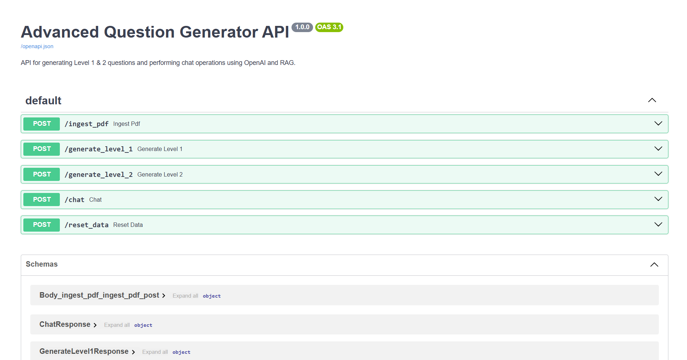

# Advanced Question Generator API Documentation

Welcome to the **Advanced Question Generator API** documentation. This API facilitates the ingestion of PDF documents, generation of Level 1 and Level 2 questions, and provides a chat interface leveraging Retrieval-Augmented Generation (RAG) using Gemni. Additionally, it offers functionality to reset ingested data and clear the vector store.

# Demo  Video

[](https://www.youtube.com/watch?v=9BnLPoM3y0M)


## Table of Contents

1. [Overview](#overview)
2. [Features](#features)
3. [Getting Started](#getting-started)
    - [Prerequisites](#prerequisites)
    - [Installation](#installation)
    - [Running the Server](#running-the-server)
4. [API Endpoints](#api-endpoints)
    - [1. Ingest PDF](#1-ingest-pdf)
    - [2. Generate Level 1 Questions](#2-generate-level-1-questions)
    - [3. Generate Level 2 Questions](#3-generate-level-2-questions)
    - [4. Chat](#4-chat)
    - [5. Reset Data](#5-reset-data)
5. [Data Models](#data-models)
6. [Error Handling](#error-handling)
7. [Logging](#logging)
8. [Dependency Injection](#dependency-injection)
9. [Additional Information](#additional-information)

---

## Overview

The **Advanced Question Generator API** is built using [FastAPI](https://fastapi.tiangolo.com/), a modern, fast (high-performance) web framework for building APIs with Python 3.7+ based on standard Python type hints. This API leverages asynchronous programming with `asyncio` to handle concurrent operations efficiently.

Key functionalities include:

- **PDF Ingestion:** Upload and process PDF files to store embeddings.
- **Question Generation:** Create Level 1 and Level 2 questions based on ingested data.
- **Chat Interface:** Provide answers to user questions using RAG techniques.
- **Data Management:** Reset ingested data and clear the underlying vector store.

## Features

- **Asynchronous Processing:** Efficient handling of multiple requests.
- **Structured Logging:** Detailed logs for monitoring and debugging.
- **Robust Error Handling:** Comprehensive error responses with appropriate HTTP status codes.
- **Dependency Injection:** Modular and maintainable code structure using FastAPI's `Depends`.
- **OpenAPI Documentation:** Interactive API docs available via Swagger UI.

## Getting Started


### Deployed Reference

**Why Bother Setting up the environment when you have a deployed Reference?😊**

*Note that both Streamlit and FASTAPI use a Free-tier version of Render (a popular cloud-infra platform), hence it spins down with inactivity and might take up to a minute to load both of the following pages*

- [Streamlit Dashboard](https://advance-question-generator-streamlit.onrender.com) - Presents a functioning Streamlit dashboard providing all the above mentioned functionality and features


- [API Reference](https://advance-question-generator-fastapi.onrender.com) - Presents a FASTAPI interface where you can use the endpoints. Find the [Swagger-UI](https://advance-question-generator-fastapi.onrender.com/docs#/) here for the deployed reference here



### Prerequisites

Before you begin, ensure you have met the following requirements:

- **Python 3.8+** installed on your machine. You can download it from [here](https://www.python.org/downloads/).
- **pip** package manager.
- **Git** (optional, for cloning the repository).

### Installation

1. **Clone the Repository**

   ```bash
   git clone https://github.com/your-repo/advanced-question-generator.git
   cd advanced-question-generator
   ```

2. **Create a Virtual Environment**

   It's recommended to use a virtual environment to manage dependencies.

   ```bash
   python -m venv venv
   source venv/bin/activate  # On Windows: venv\Scripts\activate
   ```

3. **Install Dependencies**

   ```bash
   pip install --upgrade pip
   pip install -r requirements.txt
   ```

### Running the Server

Start the FastAPI server using Uvicorn:

```bash
uvicorn app:app --reload
```

- The `--reload` flag enables auto-reloading on code changes.
- By default, the server will run on `http://127.0.0.1:8000`.

### Accessing API Documentation

FastAPI automatically generates interactive API documentation. You can access it at:

- **Swagger UI:** [http://127.0.0.1:8000/docs](http://127.0.0.1:8000/docs)
- **ReDoc:** [http://127.0.0.1:8000/redoc](http://127.0.0.1:8000/redoc)

  *Note that these auto-documentations are available only on the `local` server, once deployed these documentations cannot be found, use this [`Postman Collection`](src/constants/Advance-MCQ-Generator.postman_collection.json) instead*

---

## API Endpoints

### 1. Ingest PDF

**Endpoint:** `/ingest_pdf`  
**Method:** `POST`  
**Description:** Uploads a PDF file, processes it, and stores embeddings for question generation.

#### Request

- **Content-Type:** `multipart/form-data`
- **Parameters:**
  - `pdf_file` (file, required): The PDF file to ingest. Must have a `.pdf` extension.

- **Headers:**
  - `x_api_key` - Your Gemni API key - Please make sure it has quite some balance around `$10` would be sufficient. 

  *Note- The Free API KEY will get exhausted real soon so do not try with a free one*

#### Response

- **Status Code:** `200 OK`
- **Body:**

  ```json
  {
    "collection_name": "string",
    "status": "success"
  }
  ```

  - `collection_name` (string): The name of the collection where embeddings are stored.
  - `status` (string): Indicates successful ingestion.

#### Errors

- **400 Bad Request:** Unsupported file type or validation errors.
  
  ```json
  {
    "detail": "Only PDF files are supported."
  }
  ```

- **500 Internal Server Error:** Unexpected errors during ingestion.

  ```json
  {
    "detail": "An error occurred while ingesting the PDF."
  }
  ```

#### Example

```bash
curl -X POST "http://127.0.0.1:8000/ingest_pdf" \
  -H "accept: application/json" \
  -H "Content-Type: multipart/form-data" \
  -H "x_api_key: YOUR_API_KEY" \
  -F "pdf_file=@/path/to/your/document.pdf"
```

### 2. Generate Level 1 Questions

**Endpoint:** `/generate_level_1`  
**Method:** `POST`  
**Description:** Generates Level 1 questions from the ingested collection.

#### Request

- **Parameters:**
  - `collection_name` (query, string, required): The name of the collection to generate questions from.

- **Headers:**
  - `x_api_key` - Your Gemni API key - Please make sure it has quite some balance around `$10` would be sufficient. 

  *Note- The Free API KEY will get exhausted real soon so do not try with a free one*

#### Response

- **Status Code:** `200 OK`
- **Body:** Find the [sample response](src/results/level_1_questions_Project_Management.pdf.json) here
   
  *Note: The exact structure depends on the `GenerateLevel1Response` model.*

#### Errors

- **400 Bad Request:** Missing `collection_name` or validation errors.
  
  ```json
  {
    "detail": "Collection name is required."
  }
  ```

- **500 Internal Server Error:** Unexpected errors during question generation.

  ```json
  {
    "detail": "An error occurred while generating Level 1 questions."
  }
  ```

#### Example

```bash
curl -X POST "http://127.0.0.1:8000/generate_level_1?collection_name=my_collection" \
  -H "accept: application/json" \
  -H "x_api_key: YOUR_API_KEY" 
```

### 3. Generate Level 2 Questions

**Endpoint:** `/generate_level_2`  
**Method:** `POST`  
**Description:** Generates Level 2 questions using Retrieval-Augmented Generation (RAG) from the ingested collection.

#### Request

- **Parameters:**
  - `collection_name` (query, string, required): The name of the collection to generate questions from.

- **Headers:**
  - `x_api_key` - Your Gemni API key - Please make sure it has quite some balance around `$10` would be sufficient. 

  *Note- The Free API KEY will get exhausted real soon so do not try with a free one*

#### Response

- **Status Code:** `200 OK`
- **Body:** Find the [sample response](src/results/level_2_questions_Project_Management.pdf.json) here

  *Note: The exact structure depends on the `GenerateLevel2Response` model.*

#### Errors

- **400 Bad Request:** Missing `collection_name` or validation errors.
  
  ```json
  {
    "detail": "Collection name is required."
  }
  ```

- **500 Internal Server Error:** Unexpected errors during question generation.

  ```json
  {
    "detail": "An error occurred while generating Level 2 questions."
  }
  ```
 
#### Example

```bash
curl -X POST "http://127.0.0.1:8000/generate_level_2?collection_name=my_collection" \
  -H "x_api_key: YOUR_API_KEY" \
  -H "accept: application/json"
```

### 4. Chat

**Endpoint:** `/chat`  
**Method:** `POST`  
**Description:** Generates an answer to a user's question using Retrieval-Augmented Generation (RAG) based on the ingested collection.

#### Request

- **Parameters:**
  - `collection_name` (query, string, required): The name of the collection to use for generating the answer.
  - `question` (query, string, required): The user's question.

- **Headers:**
  - `x_api_key` - Your Gemni API key - Please make sure it has quite some balance around `$10` would be sufficient. 

  *Note- The Free API KEY will get exhausted real soon so do not try with a free one*

#### Response

- **Status Code:** `200 OK`
- **Body:**

  ```json
  {
    "answer": "string",
    "documents": [
      // List of documents relevant to the answer
    ]
  }
  ```

  - `answer` (string): The generated answer to the user's question.
  - `documents` (array): A list of documents or excerpts used to generate the answer.

#### Errors

- **400 Bad Request:** Missing parameters or validation errors.
  
  ```json
  {
    "detail": "Collection name is required."
  }
  ```

  or

  ```json
  {
    "detail": "Question cannot be empty."
  }
  ```

- **500 Internal Server Error:** Unexpected errors during chat generation.

  ```json
  {
    "detail": "An error occurred while generating the chat response."
  }
  ```

#### Example

```bash
curl -X POST "http://127.0.0.1:8000/chat?collection_name=my_collection&question=What%20is%20AI?" \
  -H "accept: application/json" \
  -H "x_api_key: YOUR_API_KEY" 
```

### 5. Reset Data

**Endpoint:** `/reset_data`  
**Method:** `POST`  
**Description:** Resets all ingested data and clears the vector store.

#### Request

- **Parameters:** None

#### Response

- **Status Code:** `200 OK`
- **Body:**

  ```json
  {
    "status": "Data reset successfully"
  }
  ```

#### Errors

- **500 Internal Server Error:** Unexpected errors during data reset.

  ```json
  {
    "detail": "An error occurred while resetting the data."
  }
  ```

#### Example

```bash
curl -X POST "http://127.0.0.1:8000/reset_data" \
  -H "accept: application/json"
```

---

## Data Models

The API utilizes several response models defined in the `src` module. Below is a general overview. For detailed structures, refer to the respective model definitions in the `src` package.

1. **IngestPDFResponse**

    - `collection_name` (string): Name of the collection where embeddings are stored.
    - `status` (string): Status of the ingestion process (e.g., "success").

2. **GenerateLevel1Response**

    - Fields as defined in the `GenerateLevel1Response` model.
    - Typically includes generated Level 1 questions and related metadata.

3. **GenerateLevel2Response**

    - Fields as defined in the `GenerateLevel2Response` model.
    - Typically includes generated Level 2 questions and related metadata.

4. **ChatResponse**

    - `answer` (string): Generated answer to the user's question.
    - `documents` (list): List of documents or excerpts used to formulate the answer.

5. **ResetDataResponse**

    - `status` (string): Status message indicating the result of the reset operation.

*Ensure that these models are properly defined in the `src` module to facilitate accurate data serialization and validation.*

---

## Error Handling

The API employs robust error handling mechanisms to ensure that clients receive meaningful feedback in case of failures.

- **Client Errors (4xx):** Indicate issues with the client's request, such as invalid input or missing parameters.
  
  - **400 Bad Request:** Returned when required parameters are missing or invalid.
  - **Detail Message:** Provides specific information about the error.

- **Server Errors (5xx):** Indicate issues on the server side, such as unexpected exceptions or failures during processing.
  
  - **500 Internal Server Error:** Returned when an unexpected error occurs.
  - **Detail Message:** Generic message indicating an error occurred.

**Example Error Response:**

```json
{
  "detail": "Specific error message describing what went wrong."
}
```

**Logging Errors:**

All errors are logged with appropriate log levels (`ERROR` or `EXCEPTION`) to facilitate debugging and monitoring.

---

## Logging

Logging is configured to capture detailed information about the API's operations, which is invaluable for monitoring, debugging, and auditing.

### Configuration

- **Logging Level:** Set to `INFO` by default.
- **Logger Name:** Uses the module's `__name__`.
  
  ```python
  logging.basicConfig(level=logging.INFO)
  logger = logging.getLogger(__name__)
  ```

### Logged Information

- **Info Logs (`INFO`):**
  - Successful receipt of requests (e.g., file ingestion, question generation).
  - Successful completion of operations.

- **Error Logs (`ERROR`):**
  - Validation failures (e.g., unsupported file types, missing parameters).
  - Expected errors due to client-side issues.

- **Exception Logs (`EXCEPTION`):**
  - Unexpected server-side errors.
  - Detailed stack traces for debugging.

**Example Log Entries:**

```
INFO:app.main:Received PDF file: document.pdf
ERROR:app.main:Unsupported file type: image.png
ERROR:app.main:Collection name is required for generating Level 1 questions.
EXCEPTION:app.main:Unexpected error during chat generation: Traceback (most recent call last):
...
```

### Customizing Logging

You can customize the logging configuration as needed, such as setting different log levels, formatting, or output destinations (e.g., files, external logging services).

### Asynchronous Operations

All endpoints are defined as asynchronous functions using `async def`, allowing the server to handle multiple requests concurrently without blocking.